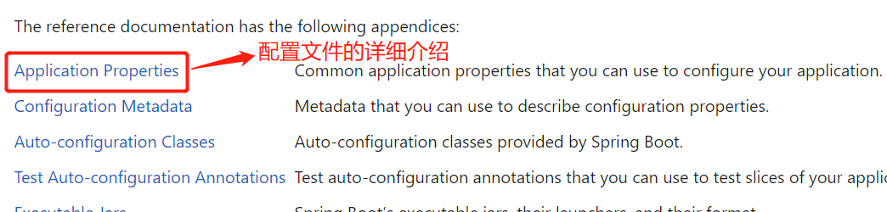
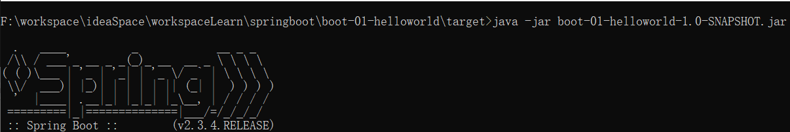

##### 1.官网

spring官网：https://spring.io/

##### 2.根据文档完成第一个实例





##### 3.将springBoot项目打成jar包

(1)在pom文件配置打包插件


(2)依次点击Maven下的clean和package进行打包


在项目的target目录下会出现打好的jar包。


(3)运行该jar包(前提先将该项目在idea中停掉)



(4)注意事项

cmd命令窗口需要关闭 快速编辑模式，否则可能会让springBoot项目的启动卡住。

cmd命令窗口上方边框栏右键选择 属性 --> 选中 选项栏 --> 去掉下方的 快速编辑模式的勾选 -->点击 确定

##### 4.修改项目启动时的banner(彩蛋)

方式：在项目的resources目录下，新建一个名称为banner的txt文件，将展示的字符输入进去，等项目启动时，banner就会变成你输入的那些字符串。

原因是springboot的主配置文件有默认配置：spring.banner.location=classpath:banner.txt

有个banner合集的网站：https://www.bootschool.net/ascii，展示的效果如下：


##### 5.依赖关系

(1)官方的各种场景启动器包的名称都是一种格式，即：spring-boot-starter-*。

(2)所有的官方场景启动器包都依赖spring-boot-starter，spring-boot-starter还依赖一个自动配置包，名称是：spring-boot-autoconfigure。这个spring-boot-autoconfigure管理着springboot的所有的自动配置，比如：aop(切面)、batch(批处理)、cache(缓存)、web等。注意：只有导入了相应的包，这些自动配置才会起效。

##### 6.配置文件

###### (1)配置文件的默认位置和优先加载顺序

- file: ./config/ (项目根路径的config文件夹下)
- file: ./ (项目根路径)
- classpath: /config/ (项目类路径的config文件夹下)
- classpath: / (项目类路径)

###### (2)properties类型文件

springboot的主配置文件名称必须是application，但它的格式可以有三种，分别为properties、yaml、yml，官方推荐使用yaml格式。

当同时存在properties类型和yaml/yml类型的配置文件，且都配置了相同的内容时，优先加载先读取到的那个配置文件中的配置内容！

###### (3)yaml/yml类型文件

1. 基本语法
   - key: value。value前必须得有一个空格
   - 大小写敏感
   - 使用缩进表示层级关系
   - 缩进不允许使用tab，只允许空格
   - 缩进的空格数不重要，只要相同层级的元素左对齐即可
   - '#'表示注释
   - 字符串无需加引号，如果要加，''与""表示字符串内容 会被 转义/不转义
   
###### (4)使用两种配置文件中的配置进行数据注入

使用properties类型和yaml/yml类型配置文件进行数据的注入，详见项目boot-01-helloworld。

有个maven引入的jar包说明一下，作用：让yml配置文件注入的属性名称能自动提示。这里的属性名称是自己项目自定义的，官方的配置本来就能自动提示。

~~~xml
<dependency>
	<groupId>org.springframework.boot</groupId>
    <artifactId>spring-boot-configuration-processor</artifactId>
    <optional>true</optional>
</dependency>
~~~

然后可以在pom文件中设置打项目jar包的时候，不包含这个提示包，减小项目jar包的体积。

~~~xml
<build>
    <!--   springBoot打jar包插件  -->
    <plugins>
        <plugin>
            <groupId>org.springframework.boot</groupId>
            <artifactId>spring-boot-maven-plugin</artifactId>
            <!--   配置项目打包时，不包含spring-boot-configuration-processor包  -->
            <configuration>
                <excludes>
                    <exclude>
                        <groupId>org.springframework.boot</groupId>
                        <artifactId>spring-boot-configuration-processor</artifactId>
                    </exclude>
                </excludes>
            </configuration>
        </plugin>
    </plugins>
</build>
~~~

###### (5)多环境配置文件配置

原因：开发环境、测试环境、生产环境这三种环境的配置可能是不同的，需要不同的配置环境来分别配置。

方式1：首先创建普通配置文件，比如application-dev.yaml和application-pro.yaml，如果主配置文件是properties类型，在其中设置spring.profiles.active=dev，则项目启动时，会加载名称为application-dev的配置文件；如果设置spring.profiles.active=pro，则会加载名称为application-pro的配置文件。

方式2：在主配置文件application.yaml中，使用---可以分割配置区域，这样就可以实现多个配置区域，相当于多个配置文件，然后在一个区域中，使用

spring:

​	profiles: dev

来给区域命名，在主配置区域中，使用

spring:

​	profiles:

​		action: dev

表示加载名称为dev的配置区域中的配置。


##### 7.静态资源

###### (1)简单介绍

默认静态资源目录为类路径下META-INF/resources、resources、static、public下。

源码：

~~~java
private static final String[] CLASSPATH_RESOURCE_LOCATIONS = new String[]{"classpath:/META-INF/resources/", "classpath:/resources/", "classpath:/static/", "classpath:/public/"};
~~~

maven项目时，类路径即为resources目录。

当把文件放到这些默认静态资源目录下后，可以直接用 项目路径+ /文件名.后缀 的方式访问该文件。

读取顺序：

```
/META-INF/resources > resources > static > public
```

当你发起一个请求时，会先去Controller类中的路径中找，找不到时才会去查找静态资源文件！

###### (2)配置静态资源访问前缀

在配置文件中添加配置：

~~~yml
spring:
  mvc:
    static-path-pattern: /res/** #默认值为 /**
~~~

改成这样之后，就得使用项目路径+ /res/文件名.后缀 的方式访问该文件

###### (3)配置自定义静态资源目录

~~~yml
spring:
  web:
    resources:
      static-locations: classpath:/目录1/,classpath:/目录2/... #优先级依排序而定
~~~

需要注意的是，一旦自行配置静态资源目录，官方配置将失效！但是META-INF/resources下的文件依然可以访问！

###### (4)配置项目默认访问页

项目默认访问页：只需要输入域名+项目名就可以访问的页面。比如：localhost:8080。localhost:8080，它的项目名是""。

+ 静态资源目录下 有index.html

  可以配置静态资源目录

  如果配置了静态资源访问前缀，则需要去掉前缀，否则不生效。

  在静态资源目录下添加文件favicon.ico可以当作页面的图标，但前提是没有配置静态资源访问前缀，并且浏览器还得刷新缓存且重新建立和网站的会话。

+ 或者Controller类有请求路径为/index的路径，然后该请求使用视图解析器导向访问页面。

##### 8.指标监控

###### (1)简介

每一个微服务在云上部署以后，我们都需要对其进行监控、追踪、审计、控制等。springBoot就抽取了Actuator场景，使我们每个微服务快速引用即可获取生产级别的应用监控、审计等功能。pom依赖：

~~~xml
<!--springboot的指标监控-->
<dependency>
    <groupId>org.springframework.boot</groupId>
    <artifactId>spring-boot-starter-actuator</artifactId>
</dependency>
~~~

当引入了该依赖之后，请求路径：/actuator/**就是访问指标监控某个Endpoint的页面，比如：/actuator/会显示当前Web可以查看的Endpoint。


官网详细使用配置：

https://docs.spring.io/spring-boot/docs/current/reference/html/actuator.html#actuator.enabling

###### (2)springBoot1.x和2.x的Actuator的不同之处


###### (3)暴露Endpoints

springBoot支持的暴露方式有两种：

​	HTTP：默认只暴露health Endpoint (springBoot2.7.3)

​	JMX：默认暴露所有Endpoint

JMX查看Endpoints：

安装jdk之后，可以在cmd命令控制台使用jconsole命令打开Java监视和管理控制台。连接本地springBoot项目。


之后可以查看所有以JMX方式暴露的Endpoint(监控端点)。


springBoot配置EndPoints：

~~~yaml
# springboot的指标监控
# 指标监控两种查看模式，一种是JMX：默认暴露所有Endpoint。一种是Web。
management:
  endpoint:
  endpoints:
    enabled-by-default: true #开启所有监控端点(默认就是true)
    web:
      exposure:
        include: '*' #以Web方式暴露所有端点，这样就能使用浏览器查看这些端点
~~~


