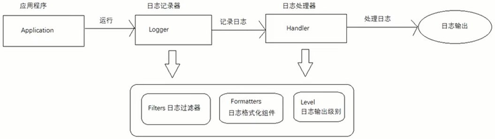

### JUL

#### 1.简单介绍

JUL全称Java Util Logging，它是java原生的日志框架，使用时不需要另外引用第三方的类库，相对其他的框架使用方便，学习简单，主要是使用在小型应用中。

#### 2.组件介绍

| 组件                | 描述                                                   |
| ------------------- | ------------------------------------------------------ |
| Logger（记录器）    | 用于记录系统或应用程序的消息，是访问日志系统的入口程序 |
| Handler（处理器）   | 从记录器获取日志消息并输出，决定日志记录最终的输出位置 |
| Filter（过滤器）    | 用于对记录的内容提供细粒度控制，超出日志级别提供的控制 |
| Formatter（格式器） | 提供对日志记录格式化的支持，决定日志记录最终的输出形式 |
| Level（日志级别）   | 定义了一组标准的日志记录级别，可用于控制日志记录的输出 |

#### 3.日志级别

| 日志级别 | 数值              | 说明                               |
| -------- | ----------------- | ---------------------------------- |
| OFF      | Integer.MAX_VALUE | 关闭所有消息的日志记录             |
| SEVERE   | 1000              | 错误信息（最高级的日志级别）       |
| WARNING  | 900               | 警告信息                           |
| INFO     | 800               | 默认信息（默认级别）               |
| CONFIG   | 700               | 配置信息                           |
| FINE     | 500               | 详细信息（少）                     |
| FINER    | 400               | 详细信息（中）                     |
| FINEST   | 300               | 详细信息（多）（最低级的日志级别） |
| ALL      | Integer.MIN_VALUE | 启用所有消息的日志记录             |

这个数值的意义在于，设置的日志级别是 INFO 级别 - 800 时，则最终展现的日志信息，必须是数值大于等于800 的所有级别信息。

#### 4.操作流程的总结

① 初始化 LogManager，LogManager 加载 logging.properties 配置文件，添加 Logger 到 LogManager 。

② 从单例的 LogManager 获取 Logger 。

③ Level 设置日志级别，在打印的过程中使用到了日志记录的 LogRecord 类。

④ Filter 作为过滤器提供了日志级别之外更细粒度的控制。

⑤ Handler 日志处理器，决定日志的输出格式，例如：XMLFormatter、SimpleFormatter；日志的输出位置，例如：控制台、文件…

⑥ Formatter 是用来格式化输出的日志内容

#### 5.项目案例

在项目jul01中，里面有jul日志框架的几种使用方式。

### Log4j

#### 1.简单介绍

Log4j（Log for java）是 Apache 的一个开源项目，通过使用 Log4j，可以控制日志信息输送的目的地是控制台或文件等，也可以控制每一条日志的输出格式。通过定义每一条日志信息的级别，能够更加细致地控制日志的生成过程。这些可以通过一个配置文件来灵活地进行配置，而不需要修改应用的代码。使用 Log4j 技术，主要使用的是其配置文件。

#### 2.组件介绍

##### (1)日志记录器

Loggers（日志记录器）控制日志的输出和日志的输出级别，以及引用 Appenders（输出控制器）。输出级别的规则是：只输出级别不低于设定级别的日志信息。

| **级别（由低至高）** | **描述**                           |
| :------------------- | ---------------------------------- |
| ALL                  | 打开所有日志记录开关；是最低等级的 |
| TRACE                | 输出追踪信息；一般情况下并不会使用 |
| DEBUG（默认）        | 输出调试信息；打印些重要的运行信息 |
| INFO                 | 输出提示信息；突出应用程序运行过程 |
| WARN                 | 输出警告信息；会出现潜在错误的情况 |
| ERROR                | 输出错误信息；不影响系统的继续运行 |
| FATAL                | 输出致命错误；会导致应用程序的退出 |
| OFF                  | 关闭所有日志记录开关；是最高等级的 |

##### (2)输出控制器 

Appender（输出控制器） 通常只负责将日志信息写入目标目的地。将格式化日志信息的责任委托给 Layout（格式器）。定义一个名字以便被 Loggers（日志记录器）引用。

常用的Appender：

| **常用**                                         | **描述**                                                     |
| ------------------------------------------------ | ------------------------------------------------------------ |
| ConsoleAppender（控制台输出器）                  | 将日志信息输出到控制台                                       |
| FileAppender（文件输出器）                       | 将日志信息写入指定文件                                       |
| DailyRollingFileAppender（按时间拆分文件输出器） | 将日志信息写入指定文件，根据设定的时间不断的产生新文件       |
| RollingFileAppender（拆分文件输出器）            | 将日志信息写入一个日志文件，并指定文件的大小，当文件大小达到指定尺寸时，会自动把文件改名，同时产生一个新文件。 |
| JDBCAppender（数据库输出器）                     | 将日志信息写入数据库表                                       |

##### (3)格式器

Layout（格式器）接收 Appender（输出控制器）的日志信息将其格式化为满足任何消费日志事件需求的样式。

| **分类**                      | **描述**                                         |
| ----------------------------- | ------------------------------------------------ |
| HTMLLayout(HTML表格格式器)    | 将日志信息输出为HTML表格形式                     |
| SimpleLayout（简单格式器）    | 将日志信息输出为简单格式，默认为 INFO 级别的消息 |
| PatternLayout（自定义格式器） | 根据自定义的转换模式，返回格式化后的日志信息结果 |

PatternLayout（自定义格式器）转换符：

| **转换符** | **描述**                                                     | 性能 |
| :--------- | ------------------------------------------------------------ | ---- |
| %c         | 用于输出日志事件的类别名称                                   |      |
| %20c       | 如果类别名称的长度少于 20 个字符，则左侧填充空格，右对齐     |      |
| %.30c      | 如果类别名称的长度大于 20 个字符，则截掉左边多出的字符，小于20则不截，也不会有空格 |      |
| %-20c      | 如果类别名称的长度少于 20 个字符，则右侧填充空格，左对齐     |      |
| %20.30c    | 如果类别名称的长度少于20个字符，则左侧填充空格，右对齐。超过30 个字符，则从左边开始截掉多出的字符 |      |
| %c         | 用于输出发出日志请求的调用者的全限定类名                     | 差   |
| %d         | 用于输出记录事件的日期，默认为ISO8601，也可以指定格式，如 %d{yyyy-MM-dd HH:mm:ss.SSS} |      |
| %F         | 用于输出发出记录请求的文件名                                 | 差   |
| %l         | 用于输出产生日志事件的调用者的位置信息，包括类名、线程、及在代码中的行数。如：Test.main(Test.java:10) | 差   |
| %L         | 用于输出发出记录请求的行号                                   | 差   |
| %m         | 用于输出与日志事件关联的应用程序提供的消息                   |      |
| %M         | 用于输出发出日志请求的方法名称                               | 差   |
| %n         | 输出平台相关的行分隔符或字符                                 |      |
| %p         | 用于输出日志事件的优先级                                     |      |
| %r         | 用于输出从构建布局到创建日志事件所经过的毫秒数               |      |
| %t         | 用于输出生成日志事件的线程名称                               |      |
| %%         | 用于输出一个百分号                                           |      |
| %x         | 输出和当前线程相关联的NDC(嵌套诊断环境)，尤其用到像java servlets这样的多客户多线程的应用中 |      |

#### 3.项目案例

在项目log4j01中，里面有log4j日志框架的几种使用方式。

#### 4.注意事项

(1)log4j最后的发布时间为2012-05-13，最新的版本为1.2.17，2015年停止维护。因此新项目不建议使用log4j，可以改用其他的日志框架。

(2)Spring Boot1.4版本以后就不再支持log4j。

(3)log4j在2019年被发现一个漏洞，编号**CVE-2019-17571**，这是一个反序列化导致的远程代码执行漏洞。

### JCL日志门面

#### 1.简单介绍

log4j是一种日志框架，JCL则是一种日志门面技术。因为每一种日志框架都有自己单独的API，使用这些API会增加代码的耦合度，且会导致切换日志框架的代价很大，因此出现了日志门面技术。该技术是一种规范，它负责调用配置的各种类型的日志框架，而我们只需要它提供的方法即可，具体的实现由它自己调用。

JCL（ Jakarta Commons Logging ），是 Apache 提供的一个 通用日志 API 。用户可以自由选择第三方的日志组件作为具体实现，像 Log4j 或 JDK 自带的 JUL 。

common-logging 会通过动态查找的机制，在程序运行时自动找出真正使用的日志框架。其内部有一个 Simple logger 的简单实现，但是功能很弱，所以 common-logging 通常都是配合着 Log4j 以及其他日志框架来使用。

使用它的好处就是，代码依赖是 common-logging 而非 Log4j 或 JUL 的 API， 避免了和具体日志框架 API 的直接耦合。也就是面向接口开发，不再依赖具体的实现类，可以根据实际需求，灵活的切换日志框架。统一的 API，统一的配置管理便于项目日志的维护工作。

JCL 有两个基本的抽象类：Log（日志记录器）、LogFactory（日志工厂，负责创建 Log 实例）。

#### 2.项目案例

在项目jcl01中，里面有jcl的使用方式。

### slf4j日志门面

#### 1.简单介绍

官方网址：https://www.slf4j.org/

SLF4J（ Simple Logging Facade For Java），即 简单日志门面。主要是为了给 Java 日志访问提供一套标准、规范的 API 框架，其主要意义在于提供接口，具体的实现可以交由其他日志框架，例如 Log4j 或 Logback 等。

SLF4J 自身也提供了功能较为简单的实现，但是一般很少用到。对于一般的 Java 项目而言，日志框架会选择 slf4j-api 作为门面，配上具体的实现框架，中间使用适配器完成适配。所以 SLF4J 最重要的两个功能就是对于日志框架的绑定以及日志框架的适配。

#### 2.适配器介绍

出现顺序：log4j-->jul-->jcl-->slf4j-->logback-->log4j2

由于log4j和jul、jcl在slf4j之前出现，因此它们没有遵从slf4j的规范，对此slf4j提供了几个适配模块，用于对这三个框架API的调用重定向为行为，就好像是对slf4j的API进行操作一样。

#### 3.日志级别

| 级别         | 描述         |
| ------------ | ------------ |
| trace        | 日志追踪信息 |
| debug        | 日志详细信息 |
| info（默认） | 日志关键信息 |
| warn         | 日志警告信息 |
| error        | 日志错误信息 |

#### 4.注意事项

(1)在没有任何其他的日志框架时，slf4j使用的是自己的slf4j-simple日志，这个slf4j-simple需要单独导入依赖。

~~~maven
<!-- slf4j自带的简单日志实现 -->
<dependency>
	<groupId>org.slf4j</groupId>
	<artifactId>slf4j-simple</artifactId>
	<version>1.7.25</version>
</dependency>
~~~

#### 5.日志集成

SLF4J 日志门面共有三种情况对日志实现进行绑定。

+ 在没有绑定任何日志实现框架的基础上，日志不能实现任何功能。slf4j-simple 是 SLF4J 官方提供的简单实现，也需要导入依赖，自动绑定到 SLF4J 日志门面上。
+ Logback 和 Simple（包括 nop） 是 SLF4J 出现后提供的日志实现框架，所以 API 完全遵循 SLF4J 进行设计。只需要导入对应的日志实现依赖，即可与 SLF4J 无缝衔接。nop 虽然也划分到实现中，但它是指不实现日志记录。
+ Log4j 和 JUL 是 SLF4J 出现前就已经存在的日志实现框架，所以 API 不遵循 SLF4J 进行设计。需要通过适配的技术，完成与 SLF4J 的衔接。

**注意：** 在 SLF4J 环境下，若同时导入多个日志实现框架，默认使用先导入的。在实际应用中，一般只集成一种日志实现。

#### 6.现有的适配器与桥接器

(1)适配器

~~~maven
<!-- jul适配器 -->
<dependency>
	<groupId>org.slf4j</groupId>
	<artifactId>slf4j-jdk14</artifactId>
	<version>1.7.25</version>
</dependency>
<!-- log4j适配器 -->
<dependency>
	<groupId>org.slf4j</groupId>
	<artifactId>slf4j-log4j12</artifactId>
	<version>1.7.25</version>
</dependency>
~~~

(2)桥接器

~~~maven
A. log4j --> slf4j
<dependency>
	<groupId>org.slf4j</groupId>
	<artifactId>log4j-over-slf4j</artifactId>
	<version>1.7.25</version>
</dependency>

B. log4j2 ---> slf4j
<dependency>
	<groupId>org.apache.logging.log4j</groupId>
	<artifactId>log4j-to-slf4j</artifactId>
	<version>2.14.1</version>
</dependency>

C. jul---> slf4j
<dependency>
	<groupId>org.slf4j</groupId>
	<artifactId>jul-to-slf4j</artifactId>
	<version>2.0.0-alpha1</version>
</dependency>

D. jcl ---> slf4j
<dependency>
	<groupId>org.slf4j</groupId>
	<artifactId>jcl-over-slf4j</artifactId>
	<version>2.0.0-alpha1</version>
</dependency>
~~~

#### 7.项目案例

在项目slf4j01中，里面有slf4j的使用方式。

### Logback

#### 1.简单介绍

Logback 官网：https://logback.qos.ch/

Logback 是由 Log4j 创始人设计的又一个开源日志组件。作为流行的 Log4j 项目的继承者，在 log4j 1.x 停止的地方接手。其架构非常通用，可以在不同的情况下应用。目前分为三个模块，logback-core、logback-classic 和 logback-access 。

logback-core 是其它两个模块的基础模块。
logback-classic 是 Log4j 的一个改良版本，并原生实现了 SLF4J API，可以轻松地更换成其他日志框架，例如 log4j 1.x 或 JUL 。
logback-access 与 Tomcat 和 Jetty 等 Servlet 容器集成，以提供 HTTP 访问日志功能。可以轻松在 logback-core 上构建自己的模块。

#### 2.组件介绍

Logback 建立在三个主要类之上 `Logger`和 `Appender` 和 `Layout` 。
 这三种类型的组件协同工作，使开发人员能够根据消息类型和级别记录消息，并在运行时控制这些消息的格式和报告位置。

##### (1)记录器

Loggers（记录器）控制日志的输出级别，规则是：只输出级别不低于设定级别的日志信息。以及引用 Appenders（输出器）。
Loggers（记录器）有一个根记录器位于记录器层次结构的顶部，它从一开始就是每个层次结构的一部分。
Loggers（记录器）之间有继承关系，例如名为 “com.foo” 的记录器是名为 “com.foo.Bar” 的记录器的父级。 同样 “java” 是 “java.util” 的父级和 “java.util.Vector” 的祖先。

##### (2)输出器

Appender（输出器）将日志记录请求打印到多个目的地，如控制台、文件、数据库等等。

##### (3)格式器

Layout（格式器）将事件转换成字符串，将日志信息格式化并输出。在 Logback 中 Layout 对象被封装在 encoder 中。

Pattern Layout（自定义格式器）常用转换符：

| 转换词             | 描述                                                   | 性能 |
| ------------------ | ------------------------------------------------------ | ---- |
| %c                 | 在记录事件的起源处输出记录器的名称                     |      |
| %C                 | 输出发出日志请求的调用者的完全限定类名                 | 差   |
| %d                 | 用于输出记录事件的日期，如 %d{yyyy-MM-dd HH:mm:ss.SSS} |      |
| %F / file          | 输出发出记录请求的 Java 源文件的文件名                 | 差   |
| %L / line          | 输出发出记录请求的行号                                 | 差   |
| %m / msg / message | 输出与日志事件关联的应用程序提供的消息                 |      |
| %M / method        | 输出发出记录请求的方法名称                             | 差   |
| %n                 | 输出平台相关的行分隔符或字符                           |      |
| %p / le / level    | 输出日志事件的级别                                     |      |
| %r / relative      | 输出从应用程序启动到创建日志记录事件所经过的毫秒数     |      |
| %t / thread        | 输出生成日志事件的线程的名称                           |      |
| %20c               | 如果记录器名称的长度少于 20 个字符，则用空格填充       |      |
| %-20c              | 如果记录器名称的长度少于 20 个字符，则用空格填充右侧   |      |
| %.30c              | 如果记录器名称超过 30 个字符，则从头部截断             |      |
| %.-30c             | 如果记录器名称超过 30 个字符， 则从尾部截断            |      |

#### 3.补充内容

##### (1)配置文件

Logback 提供了 3 种配置文件： logback.[groovy](https://so.csdn.net/so/search?q=groovy&spm=1001.2101.3001.7020) ，logback-test.xml ，logback.xml ，若都不存在则采用默认配置。但是一般企业最常用的是logback.xml形式的配置文件。

##### (2)异步日志配置

a.可配置属性-阈值
当队列的剩余容量小于这个阈值的时候，当前日志的级别trace、debug、info这3个级别的日志将被丢弃。设置为0(默认值)，说明永远都不会丢弃trace、debug、info这3个级别的日志。<discardingThreshold>0</discardingThreshold>
b.配置队列的深度，这个值会影响记录日志的性能，默认值就是256
<queuesize>256</queuesize>
关于这两个属性，一般情况下，我们使用默认值即可不要乱配置，会影响系统性能，了解其功能即可。

##### (3)log4j转换logback

因为log4j的配置文件是properties格式，而logback是xml格式，二者不同。想转换二者配置文件的内容可以去logback官网，找到log4j.properties转换器，用其转换内容。但如果有log4j独立的技术或者二者不兼容的技术，则这部分内容无法转换。

#### 4.项目案例

在项目logback01中，里面有logback的使用方式。
